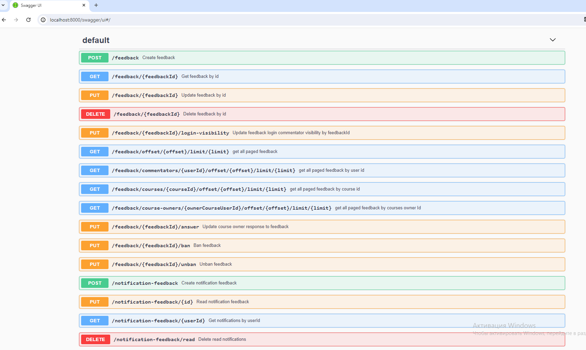

# Сервис обратной связи для курса

Предоставляет АПИ по созданию обратной связи


Видео с работой сервиса:
https://drive.google.com/file/d/1rKvlu1MWCd0EA4Fs3uhy7h78w8DIJRrl/view?usp=sharing

## Overview

Проект содержит следующие зависимости:

- [oatpp](https://github.com/oatpp/oatpp)
- [oatpp-swagger](https://github.com/oatpp/oatpp-swagger)
- [oatpp-postgresql](https://github.com/oatpp/oatpp-postgresql)

### Структура проекта

```
|- CMakeLists.txt                        // projects CMakeLists.txt
|- src/
|    |
|    |- common_int/                      // Публичные интферфейсы для Си
|    |- controller/                      // Контроллеры для взаимодействия по Rest api
|    |- db/                              // Компоненты для взаимодействия с БД
|    |- dto/                             // ДТО
|    |- service/                         // Сервисы для взаимодействия с БД
|    |- ServiceComponent.hpp             // Конфигурация компонентов (port, ObjectMapper, Database)
|    |- SwaggerComponent.hpp             // Конфигурация для swagger-ui
|    |- AppComponent.hpp                 // Конфигурация приложения (controllers)
|    |- DatabaseComponent.hpp            // Конфигурация БД
|    |- init.cpp                         // Конфигурация приложения
|    |- init.h                           // Конфигурация приложения
|    |- init.hpp                         // Конфигурация приложения
|    |- App.c                            // main() is here
|    
|- utility/install-oatpp-modules.sh      // скрпит для скачивания библиотек .
|- resources/config.json                 // конфигурация подключения к БД, порты, хосты
|- Dockerfile                            // Dockerfile - сборка сервиса
|- docker-compose.yaml                   // Docker-compose - сборка сервиса и создание БД
```

---

## Сборка и запуск

### С использованием CMake

**Требования**

- Необходимо установить PostgreSQL.
    - On Alpine `$ apk add postgresql-dev`
    - On Ubuntu `$ apt-get install postgresql-server-dev-all`
    - On Windows : скачать исходники PostgreSQL на официальном сайте и перед скачиванием компонента `oatpp-postgresql`
      установить значение с адресом к установленной БД `set(PostgreSQL_INCLUDE_DIR "E:\\program\\Postgresql\\include")`
      в **utility/tmp/oatpp-postgresql/CMakeList.txt**

- Должны быть установлены компоненты  `oatpp`, `oatpp-swagger` и `oatpp-postgresql`.
  Запуск `utility/install-oatpp-modules.sh` или `или utility/gen.bat` загрузит нужные зависимости определенных версий.

```
$ mkdir build && cd build
$ cmake ..
$ make 
$ ./eop_feedback-exe  # - run application.
```

### С использованием Docker

#### Запуск с Dockerfile

```
$ docker build -t eop_feedback .
$ docker run -p 8000:8000 -e CONFIG_PROFILE='dev' -t eop_feedback
```

#### Запуск с docker-compose

```
$ docker-compose up
```

*docker-compose will run service with `local-docker` config profile*

### После запуска

Переходим на [http://localhost:8000/swagger/ui](http://localhost:8000/swagger/ui) для просмотра эндпоинтов.

